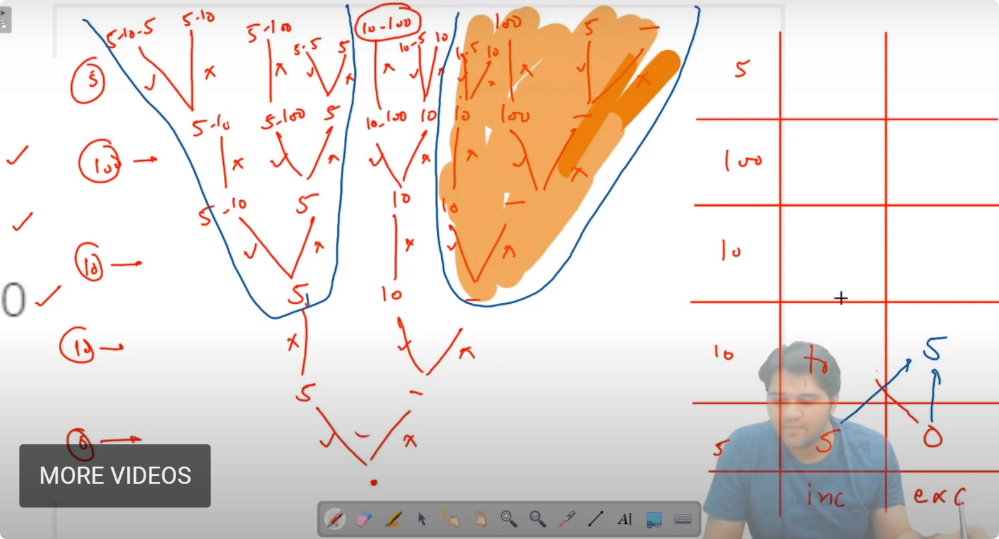
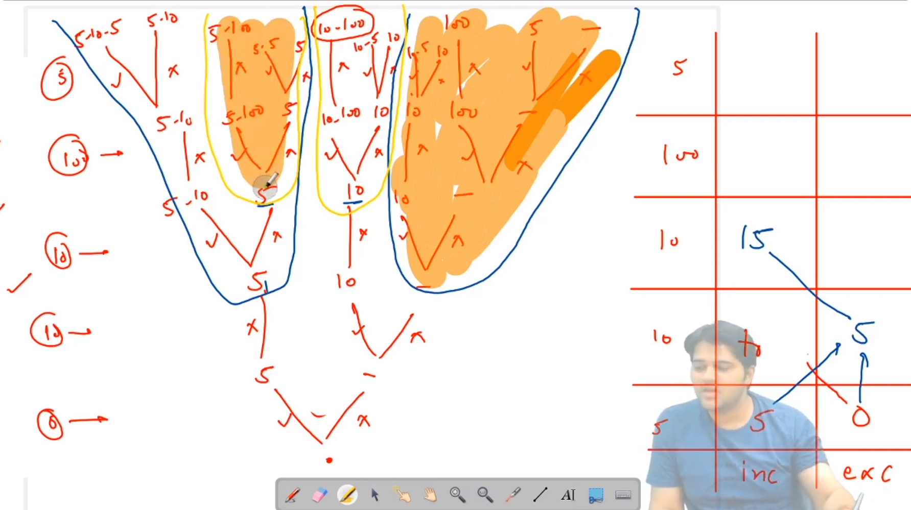
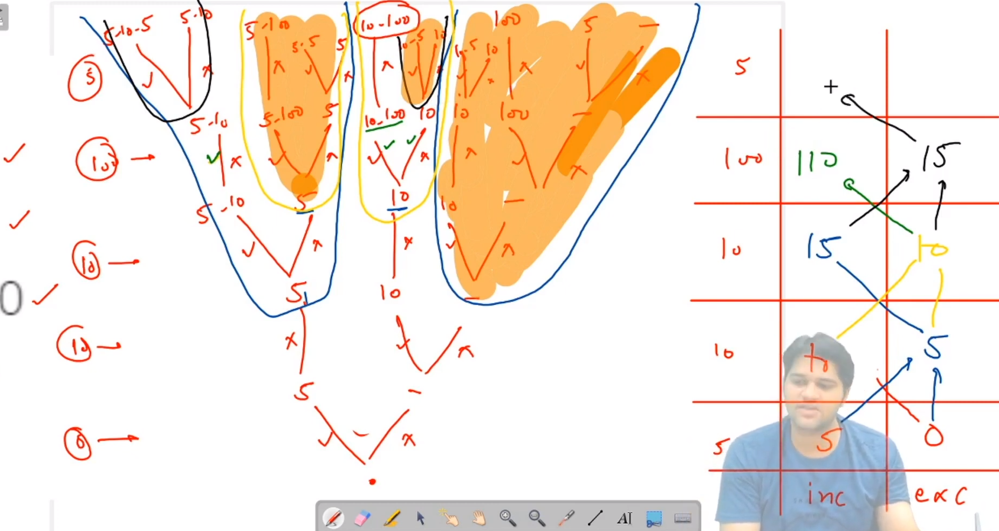

##Future of selected outlined part is same

###### only difference in them is the past' difference

###### the prior difference only

#### the shape of the tree from a node is govern by last decision

&emsp;&emsp;&emsp;&emsp;&emsp;&emsp;&emsp;&emsp;👇🏻

👇🏻

